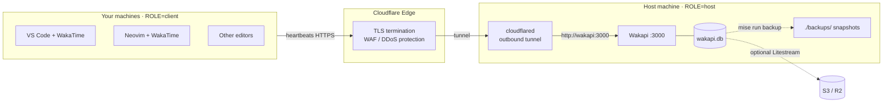

# wakapi-stack

[](LICENSE)


A clean, self-hosted [Wakapi](https://github.com/muety/wakapi) deployment —
the open-source, WakaTime-compatible backend for coding-time stats — behind an
optional [Cloudflare Tunnel](https://developers.cloudflare.com/cloudflare-one/connections/connect-networks/)
for zero-exposure public access.

Track coding hours per language / project / editor across all your machines,
reporting into one instance you control. Runs anywhere Docker Engine runs —
bare metal, a VM, a homelab box, or Docker inside WSL2.

- **No open inbound ports, no public origin IP** — the tunnel dials outbound,
  so the host stays invisible behind Cloudflare's edge.
- **One repo, every machine** — the same `git pull` lands everywhere; a local,
  gitignored `.env` decides whether a box is the **host** or a **client**.
- **One file of state** — SQLite by default; back it up by copying one file.
- **Reproducible tasks** — [mise](https://mise.jdx.dev) gives identical
  `mise run <task>` commands on macOS, Linux, and WSL2.
- **Nothing personal in the repo** — all config lives in `.env`.

---

## Architecture



> Local-only mode (no `tunnel` profile) drops Cloudflare — the host is
> reached directly on `http://localhost:3000` or LAN address.

---

## The host / client model

The repository never encodes which machine is the server. **Role is local
config, not code.** Each machine's gitignored `.env` sets `ROLE`:

| `ROLE` | What `mise run up` does | How many machines |
|---|---|---|
| `host` | Runs the Docker stack (Wakapi + chosen profiles) | exactly one |
| `client` | Writes `~/.wakatime.cfg` to report to the host; starts nothing | all others |

`ROLE` has **no default** — an unset value fails loudly. Promoting a new
server is a two-line `.env` change on two machines, never a commit.

---

## Prerequisites

| Dependency | Where needed | Notes |
|---|---|---|
| [Docker Engine](https://docs.docker.com/engine/) + Compose plugin | host | System install — not managed by mise |
| [mise](https://mise.jdx.dev) | all machines | Cross-OS task runner |
| `uv` | machines running validation | Pinned by mise; used to run pre-commit via `uvx` |
| `openssl` | all machines during first init | Generates `WAKAPI_SALT`; clients can ignore the generated host-only value |
| `sqlite3` | host (backup/restore) | `sudo apt install sqlite3` |

> **mise** is used here as the task runner. There is no application runtime to
> pin; `uv` is pinned only as an operational validation tool.

---

## Quick start — host machine

```bash
# 1. Install mise: https://mise.jdx.dev
git clone <this-repo> ~/src/wakapi-stack && cd ~/src/wakapi-stack

# If mise warns that this project config is untrusted, review mise.toml,
# then run this once from the repo root:
mise trust

# 2. Bootstrap .env with a generated salt
mise run init

# 3. Edit .env:
#   ROLE=host
#   WAKAPI_PUBLIC_URL=https://wakapi.example.com  # or http://localhost:3000
#   COMPOSE_PROFILES=tunnel                        # omit for local-only
#   WAKAPI_ALLOW_SIGNUP=true                       # temporarily, to register
#   CF_TUNNEL_TOKEN=<your token>                   # if using tunnel profile

# 4. Start the stack
mise run up

# 5. Open http://localhost:3000, create your account
# 6. Copy your API key from Settings

# 7. Lock down — set in .env then restart
#   WAKAPI_ALLOW_SIGNUP=false
mise run restart

# Local-only HTTP: if dashboard login cookies don't persist, add to .env:
#   WAKAPI_INSECURE_COOKIES=true
# Keep it false (the default) for any public HTTPS setup.
```

---

## Quick start — client machine

```bash
git clone <this-repo> ~/src/wakapi-stack && cd ~/src/wakapi-stack
mise run init

# Edit .env:
#   ROLE=client
#   WAKAPI_PUBLIC_URL=https://wakapi.example.com
#   WAKAPI_API_KEY=<your key from the host's Settings page>

mise run up   # writes ~/.wakatime.cfg
```

Then install the [WakaTime plugin](https://wakatime.com/plugins) for your
editor — it picks up `~/.wakatime.cfg` automatically.

**WSL2 note:** run `mise run up` inside the Linux shell (not PowerShell).
Your editor's WakaTime plugin runs under Remote-WSL and reads the Linux home
directory.

---

## Cloudflare Tunnel setup

1. [Create a tunnel](https://developers.cloudflare.com/cloudflare-one/connections/connect-networks/get-started/)
   in the Zero Trust dashboard.
2. Add a **Public Hostname** route:
    - Hostname: `wakapi.example.com`
   - Service: `http://wakapi:3000`
3. Copy the tunnel token → `CF_TUNNEL_TOKEN` in `.env`.
4. Set `COMPOSE_PROFILES=tunnel` and `WAKAPI_PUBLIC_URL=https://wakapi.example.com`.
5. `mise run up`.

Recommended Cloudflare hardening (configure in the dashboard, not automatic):
WAF rules, rate limiting, and Bot Fight Mode for the `/api/heartbeats` endpoint.

After configuring Cloudflare Access (if you add it), verify with `curl` that
anonymous `/api/*` requests behave as expected and that editor heartbeats still
succeed.

---

## Available tasks

```
mise run init          # create .env from .env.example (first-time, any machine)
mise run up            # start stack (host) or write wakatime cfg (client)
mise run down          # stop stack (host only)
mise run restart       # recreate containers without pulling (host only)
mise run pull          # pull new images + restart (host only)
mise run logs          # follow stack logs (host only)
mise run ps            # show service status (host only)
mise run config        # validate docker-compose.yml using local .env
mise run validate      # run all checks: pre-commit + default/all-profile compose validation
mise run backup        # snapshot SQLite to ./backups/ (host only)
mise run restore <file>  # restore from backup (host only, stack must be down)
mise run client-setup  # write ~/.wakatime.cfg (client machines)
```

---

## Backup & restore

```bash
# Backup (safe while running)
mise run backup

# Restore (stack must be stopped first)
mise run down
mise run restore ./backups/wakapi-20260101-120000.db
mise run up
```

Backups use `sqlite3 .backup` which is safe for live files. For continuous
offsite backup, see the Litestream section in `docker-compose.yml`.

---

## Image versions

| Image | Default pinned version | Override env var |
|---|---|---|
| `ghcr.io/muety/wakapi` | `2.17.4` | `WAKAPI_VERSION` |
| `cloudflare/cloudflared` | `2026.5.2` | `CLOUDFLARED_VERSION` |
| `containrrr/watchtower` | `1.7.1` | `WATCHTOWER_VERSION` |
| `litestream/litestream` | `v0.5.11` | `LITESTREAM_VERSION` |

Pin a specific version in `.env`. Run `mise run pull` after updating.

---

## Repository structure

```
wakapi-stack/
├── .github/
│   ├── workflows/ci.yml       # pre-commit + compose validation + secret scan
│   ├── dependabot.yml         # Automated dependency update PRs
│   └── CODEOWNERS             # Required reviewers for automation changes
├── .vscode/                   # Editor recommendations and settings
├── scripts/
│   ├── init.sh                # Bootstrap .env
│   ├── role.sh                # Host vs. client dispatcher
│   ├── require-host.sh        # Guard for host-only mise tasks
│   ├── client-setup.sh        # Write ~/.wakatime.cfg
│   ├── backup.sh              # SQLite snapshot
│   └── restore.sh             # Restore from snapshot
├── .env.example               # Template — copy to .env, never commit .env
├── .editorconfig
├── .gitignore
├── .pre-commit-config.yaml    # gitleaks + shellcheck + hygiene hooks
├── docker-compose.yml
├── litestream.yml.example
├── mise.toml                  # Tasks + pinned validation tooling
└── LICENSE
```
